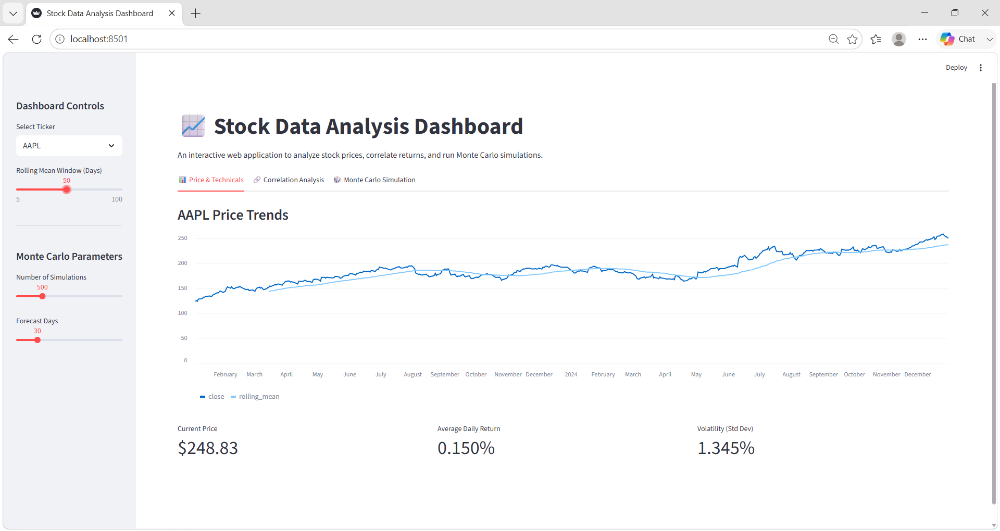
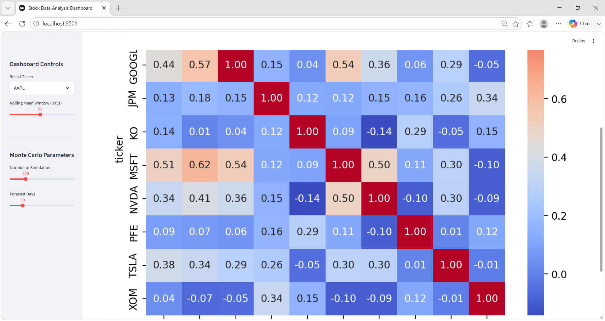
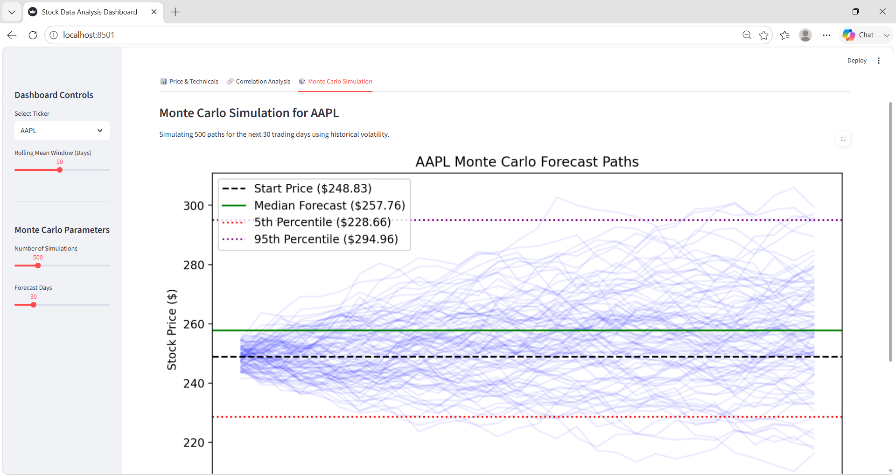

# Stock Data Analysis Toolkit

A simple project using Python, Pandas, NumPy, and SQL to learn and compare data manipulation approaches. No complex pipelines or deployment needed.

## Setup

```bash
pip install yfinance pandas numpy
```

Note: SQLite comes built-in with Python, so there's no need to install a database server.

## Run Order \& How it Works

1. **01\_fetch\_and\_clean.py**: Downloads raw stock data using `yfinance`, cleans it (removes duplicates, handles missing values), calculates daily returns, and saves the output to `prices\_clean.csv`.
2. **02\_load\_to\_sql.py**: Loads the clean CSV into a local SQLite database (`stocks.db`) and sets up a composite index to keep queries fast.
3. **03\_sql\_vs\_pandas.py**: Solves the same analytical questions in both SQL and Pandas to show how the syntax and logic compare side-by-side.
4. **04\_numpy\_exercises.py**: Re-implements Pandas operations using raw NumPy arrays, and runs a Monte Carlo simulation.

## Progress

## Progress

* \[x] Step 1: Download \& clean stock data (saved to `prices\_clean.csv`)
* \[x] Step 2: Load clean data to SQLite database (`stocks.db`)
* \[x] Step 3: Compare queries in SQL vs Pandas
* \[x] Step 4: Run NumPy exercises \& Monte Carlo simulation
* \[x] Step 5: Build interactive Streamlit dashboard (final version — Quantitative Analytics Terminal)

## Dashboard (v1 — before redesign)

Interactive Streamlit dashboard with ticker selection, rolling mean, correlation heatmap, and Monte Carlo simulation.





## 🖥️ Quantitative Analytics Terminal Stock Analysis Toolkit (Final Version)

A professional financial dashboard integrating SQLite indexing, Pandas analytics, and Monte Carlo NumPy projections.

**Features:**
- SMA crossover signals (configurable short/long windows) with BUY/SELL indicators
- Candlestick price chart with moving averages
- Monte Carlo simulation (configurable paths & forecast days) with percentile bands
- Inter-asset correlation heatmap across all 10 tickers
- Dual-asset regression study — compare any two tickers' daily returns


