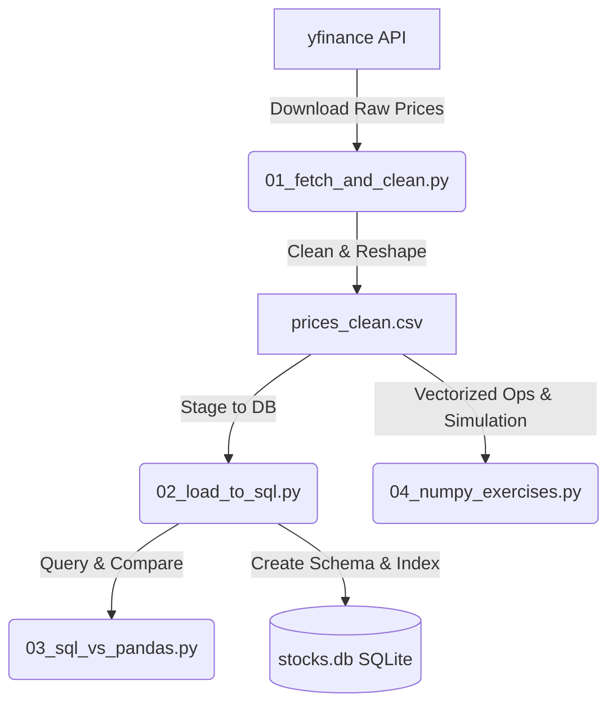

# Stock Data Analysis Toolkit 📈

A hands-on coding sandbox designed to build and test core skills in data manipulation, SQL database staging, mathematical operations, and vectorized computation. 

Rather than relying on pre-built pipelines or complex orchestration, this project focuses on implementing real-world financial data tasks from scratch using the fundamental Python data science stack: **Pandas, NumPy, and SQL (SQLite)**.

---

## 🏗️ Architecture & Data Flow

The toolkit follows a linear 4-stage pipeline. Each stage is designed to teach a specific pillar of data engineering and quantitative analysis:



---

## 🛠️ Tech Stack & Requirements
* **Language:** Python 3.x
* **Core Libraries:** `pandas`, `numpy`, `yfinance`
* **Database:** SQLite (embedded, zero-configuration)

### Installation
Run the following command to install the required libraries:
```bash
pip install yfinance pandas numpy
```

---

## 🚀 Execution & Run Order

Run the scripts in sequential order to build the database and execute comparisons:

1. **`python 01_fetch_and_clean.py`**
   * Downloads ~2 years of historical daily prices for 10 tickers.
   * Cleans missing data and drops duplicates.
   * Generates a computed `daily_return` per stock.
   * Saves clean output to `prices_clean.csv`.

2. **`python 02_load_to_sql.py`**
   * Reads `prices_clean.csv` and stages it into a local SQLite database (`stocks.db`).
   * Establishes a composite index on `(ticker, date)` to simulate production-ready query performance.

3. **`python 03_sql_vs_pandas.py`**
   * Solves 4 analytical interview-style questions side-by-side using SQL queries and Pandas syntax.
   * Maps concepts like window functions (`RANK() OVER`), lag offsets (`LAG()`), and cumulative returns between SQL and Pandas.

4. **`python 04_numpy_exercises.py`**
   * Re-implements Pandas' built-in functions (`pct_change` and `.rolling().mean()`) using vectorized NumPy slicing.
   * Calculates correlation matrices with raw matrix operations.
   * Runs a 1,000-path Monte Carlo simulation for future price paths.

---

## 📊 Project Progress Tracker

Use this checklist to track your progress as you run and explore the sandbox:

- [x] **Step 1:** Download & Clean Stock Data (`01_fetch_and_clean.py`)
  * *Result:* `prices_clean.csv` successfully generated.
- [ ] **Step 2:** Stage Data to SQL Database (`02_load_to_sql.py`)
  * *Result:* `stocks.db` database created and indexed.
- [ ] **Step 3:** Compare SQL and Pandas Analytics (`03_sql_vs_pandas.py`)
  * *Result:* SQL vs Pandas analysis printed and compared.
- [ ] **Step 4:** Vectorized NumPy & Monte Carlo (`04_numpy_exercises.py`)
  * *Result:* Vectorized calculations matching and simulations complete.

---

## 💡 Key Learning Goals & Interview Mappings

| SQL Concept | Pandas Equivalent | Learning Value |
|---|---|---|
| `GROUP BY` + `AVG()` | `.groupby().mean()` | Basic aggregation mapping |
| `RANK() OVER (PARTITION BY ...)` | `.groupby().transform(lambda x: x.rank())` | Window partitioning and filtering |
| `LAG(col, n)` | `.groupby().shift(n)` | Time-series shifting/relative comparisons |
| Composite Index | Pivot tables & MultiIndex | Query performance and database optimization |
| Row-by-row iteration | Vectorized array slicing (`np.cumsum`) | Performance scaling from $O(n \times w)$ to $O(n)$ |

---

## 🧪 Experiments to Try (Go Beyond the Code!)
* **Try a Sector Basket:** Edit `TICKERS` in `01_fetch_and_clean.py` to target a single sector (e.g., tech, energy) and observe how the correlation matrix changes in Step 4.
* **Tweak the Monte Carlo Count:** Change simulations from `1000` to `10` in `04_numpy_exercises.py` to see how percentiles get noisier.
* **Create a 5th Question:** Add a comparison task, such as computing the monthly average trading volume per stock, in both SQL and Pandas.
